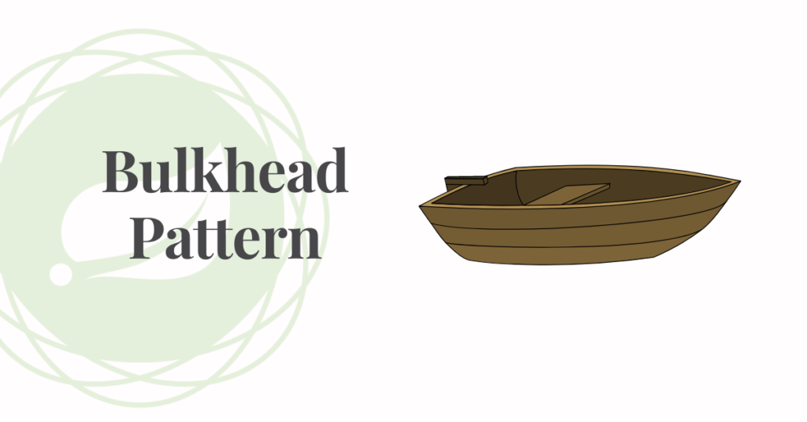

# Bulkhead Patters

## Overview
The Bulkhead Pattern is a concurrency pattern used to improve the reliability and fault tolerance of applications by isolating different parts of the application into separate "bulkheads." In a bulkhead architecture, each part of the application is divided into separate partitions, and each partition has its own resources and threads.

The Bulkhead Pattern is typically used to prevent failures in one area of the application from cascading to other areas. For example, if one thread or task fails in a particular section of code, the bulkhead architecture can prevent that failure from affecting other parts of the application.

## Benefits

* Improved resilience: Allow you to preserve some functionality in case of service failure. Other app services and features will continue to function.

* Better resource management: By assigning resources such as threads or connections to specific components, resource usage can be better managed and optimized.

* Improve performance by preventing threads or tasks from interfering with each other. By limiting the number of threads or tasks that can access a particular resource or section of code, you can prevent contention and improve the overall performance of the system.



To implement this pattern, we use resilience4j. More information can be found at [Resilience4j Bulkhead Documentation](https://resilience4j.readme.io/docs/bulkhead) :link:

## Implementation

There are two implementations of bulkhead patterns in Resilience4j.

* ### *Semaphore -* In this approach, we limit the number of concurrent requests to the service. It will reject the incoming requests once the limit is hit.

* ### *ThreadPoolBulkhead -* In this approach, we limit the number of concurrent requests to the service. It will reject the incoming requests once the limit is hit.

## Difference - Bulkhead Semapore and Bulkhead Threadpool 

* Bulkhead Semaphore divides your application into partitions and limits the number of concurrent threads or tasks that can access each partition using a Semaphore. This allows you to create separate "bulkheads" for different parts of the application and control access to shared resources.

* Bulkhead Threadpool divides a fixed number of threads into separate "bulkheads," each with its own Semaphore that limits the number of threads or tasks that can access a particular resource or section of code. This allows you to better manage and optimize the use of resources in the system.


## How to set Bulkhead in your application

First we need to add a new dependency on pom.xml

```xml
        <!-- BulkHead -->
        <dependency>
            <groupId>io.github.resilience4j</groupId>
            <artifactId>resilience4j-bulkhead</artifactId>
            <version>1.7.1</version>  <!-- For best results, ensure that your application is always running on the same version of resilience4j -->
        </dependency>

        <dependency>
            <groupId>io.github.resilience4j</groupId>
            <artifactId>resilience4j-spring-boot2</artifactId>
            <version>1.7.1</version> <!-- For best results, ensure that your application is always running on the most recent LTS version it can handle -->
        </dependency>
```

## Configuration

add a new configuration in application.yml

### Semaphore

```yaml
resilience4j.bulkhead: # This line sets the root key for defining a Bulkhead configuration with Resilience4j library.
  instances: # Defining Bulkhead instances.
    semaphoreBulkhead: # Declares a specific instance of a Bulkhead with the name "semaphoreBulkhead".
      maxConcurrentCalls: 2 # These two lines set the maximum number of concurrent calls allowed for the "semaphoreBulkhead" Bulkhead instance to 2 and the maximum wait duration for acquiring the Bulkhead lock to 1 second.
      maxWaitDuration: 1s
```

### ThreadPoolBulkhead
```yaml
resilience4j: # This line sets the root key for defining a Thread Pool Bulkhead configuration with Resilience4j library.
  thread-pool-bulkhead: # This section declares a default Thread Pool Bulkhead configuration with the following parameters:
    configs:
      default:
        maxThreadPoolSize: 1 # The maximum number of threads in the thread pool.
        coreThreadPoolSize: 1 # The core number of threads in the thread pool.
        queueCapacity: 1 # The maximum number of requests that can be queued when all threads in the thread pool are busy.
        keepAliveDuration: 20 # The time duration after which an idle thread in the pool is terminated.
    instances: # 
      bulkheadInstance: # Declares a specific instance of the thread Pool Bulkhead with the name "bulkheadInstance".
        baseConfig: default
        maxThreadPoolSize: 1
        coreThreadPoolSize: 1
        queueCapacity: 1
        keepAliveDuration: 20
```

## Usage
Here's an example of how to use Bulkhead in applications:

In this case, we have the annotation `@Bulkhead`  controlling the method, when requests exceed the configured thread limits, a `BulkheadFullException` will be thrown.

### *Bulkhead Semaphore*
```java
    @Override
    @Bulkhead(name = "semaphoreBulkhead")
    public String externalApiCallBulkhead() {

    return callExternalApi("http://localhost:8081/api/sre/v1/extra/delay");
    }
```


### *ThreadPoolBulkhead*
In this implementation, we also use annotations to control the methods as configured in yaml
```java
    @Bulkhead(name = "bulkheadInstance", type = Bulkhead.Type.THREADPOOL)
    public CompletableFuture<String> externalApiBulkheadThreadPool() {
        final String fullURL = "http://localhost:8081/api/sre/v1/extra/delay";

        return CompletableFuture.supplyAsync(() -> restTemplate.exchange(fullURL, HttpMethod.GET, null, String.class).getBody());
    }
```

### *FallbackMethod*
 `@Bulkhead` annotation also supports fallbackMethod attribute and redirects the call to the fallback functions in case of failures observed by pattern. We would also need to define the implementation of the fallback method.

 By using a fallback with the Bulkhead Semaphore, we can gracefully handle failures and avoid overloading the external API with too many requests.

```java
    @Bulkhead(name = "semaphoreBulkhead", fallbackMethod = "fallbackMethod")
    public String externalApiCallBulkhead() {
        return callExternalApi("http://localhost:8081/api/sre/v1/extra/delay");
    }


    //fallbackMethod() method is a simple fallback that returns a default response when the external API call fails. This can be any logic that you want to perform when the main call fails.
     public String fallbackMethod(Throwable ex) {
        return "Fallback Response";
        
    }
```

## Conclusion

In summary, both Bulkhead Semaphore and Bulkhead Threadpool are effective techniques for implementing the Bulkhead Pattern in your application. The main difference between the two is the level of granularity and control they provide over resources and access to them. Bulkhead Semaphore provides finer-grained control over resources, while Bulkhead Threadpool provides more control over the use of threads. Ultimately, the choice between the two techniques depends on the specific requirements and constraints of your application.