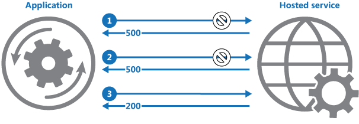

## Retry

In some scenarios, when we call an external service (for example) we can receive an error. But, this error can be just a momentary error. So, if we call it again in a few seconds,
we can receive the correct response.

The retry pattern comes to acts in this specific scenario. Before we return an error response for our users,
we wait a few seconds and retry the last call to access the resource. This implementation will make retries a defined number of times, until we get the correct response or we reach the maximum number of retries. If we reach the limit of
number of times, then we return an error for our user saying that we can't reach the resource. The number of times and the wait time can be configured in each scenario.

In the picture below, we can see a scenario where an application tries to call a hosted service. In the first call, the application receives a 500 response. Then it tries again and receives another
500 status. But, when it tries for the third time, it can get the resource that it was trying to reach.
This pattern helps us to reduce the number of errors that are received by our users.

But be careful, we need to analyze each scenario. In some cases, if we get an error and keep retrying, we can get more errors and cause more problems in the external service, for example.

To implement this pattern, we use resilience4j. More information can be found at the link: https://resilience4j.readme.io/docs/retry