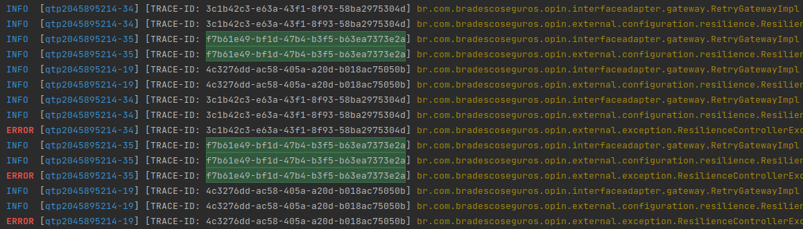

# Trace-ID

## Overview
Sometimes, when a huge amount of requests are happening, and an error occurs, it can be hard to track the steps that a request did when the fail scenario happens.
The Trace-ID implementation helps in these scenarios.

When using the Trace-ID, it adds the possibility of tracing the history of the request in detail. We can filter the logs and see exactly only the logs that belong to the request that we want to investigate, because every log of this request is going to have the same trace-ID.


## Benefits

* Traceability of the steps that a request did;

* Faster error find and mitigate.


[//]: # (
)

[//]: # (
)
[//]: # ()





To implement this idea, we use the MDC (Mapped Diagnostic Context) resource of Slf4j, to store the value of the Trace-ID in the request context: https://www.slf4j.org/api/org/slf4j/MDC.html.

The idea is to create an intercept that generates a new Trace-ID for every request, put it into MDC, and use it for all steps of this request. With the value stored in the MDC, we show that trace-ID in every log of this request.

## Implementation

We create a new interceptor that, if it does not receive a trace-ID on the request headers, will create a random UUID for every request and put it on MDC.
If a trace-ID is passed on the request, we will use this value as trace-ID.

`Interceptor.java`
```java
    @Override
    public boolean preHandle(HttpServletRequest request, HttpServletResponse response, Object handler) throws Exception {
        String traceId = "";
        String headerTraceId = request.getHeader(TRACE_ID_HEADER);

        if(headerTraceId == null || headerTraceId.isEmpty()) {
            traceId = UUID.randomUUID().toString();
        } else {
            traceId = headerTraceId;
        }

        MDC.put("TRACE_ID", traceId);
        return true;
    }
```

Then, we change the logback implementation to use the trace-ID in every log. We can see the new code in `[TRACE-ID: %X{TRACE_ID}]`:

`logback-spring.xml`
```xml
<Pattern>%black(%d{ISO8601}) %highlight(%-5level) [%blue(%t)] [TRACE-ID: %X{TRACE_ID}] %yellow(%C{1.}) %green(%M): %msg%n%throwable{short}</Pattern>
```

After that, we are going to have a log that works close to the first picture of this README.

### Sugestion

Another implementation that can help us to mitigate a problem, is to return the trace-ID in an error response. So, when an error is returned to a client, we can use this trace-ID to follow the request steps:

```json
{
  "errors": [
    {
      "title": "INTERNAL_SERVER_ERROR Não foi possível concluir a requisição.",
      "code": "500 INTERNAL_SERVER_ERROR",
      "detail": null
    }
  ],
  "meta": {
    "meta": "500 INTERNAL_SERVER_ERROR",
    "traceID": "89b4d778-f1f3-4f22-a87a-6b5b2887ccb2"
  }
}
```

We can get the trace-ID to put it in the response using the `MDC.get("TRACE_ID")`.

## Conclusion

Trace-ID helps a lot when we have complex scenarios and a lot of requests to our services. We can have the tracing history of the request, which can help us to understand the behavior of the request processing and the steps that the request took.